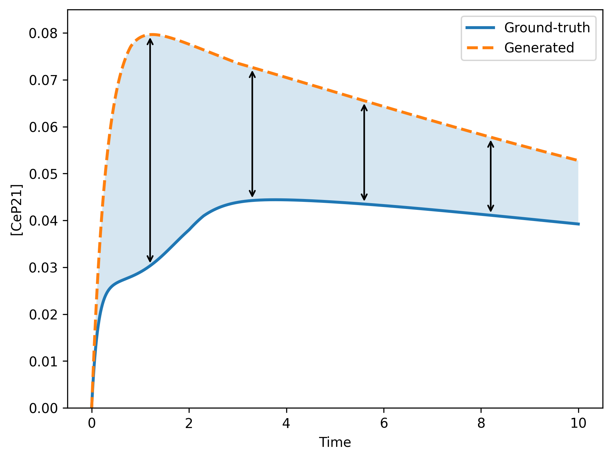
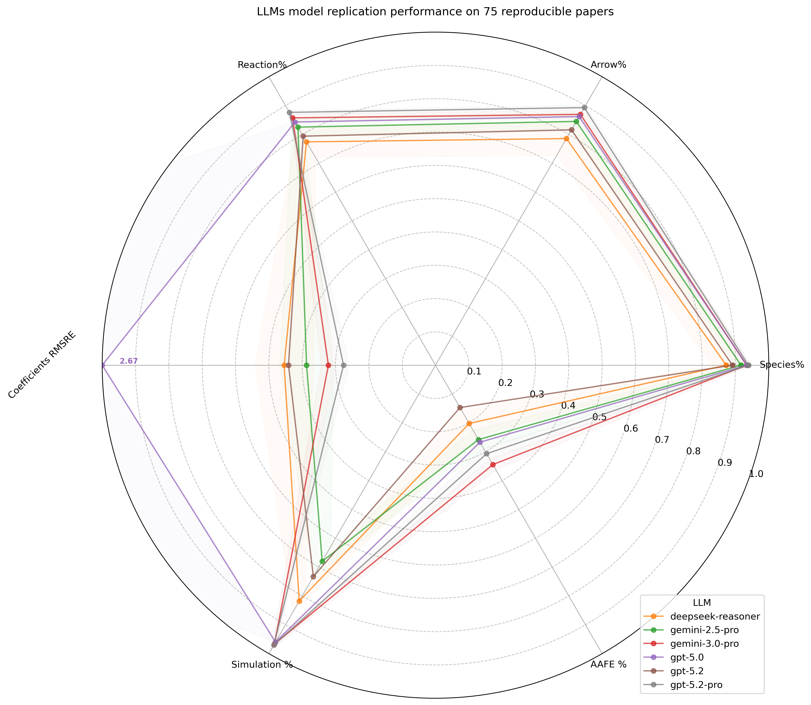
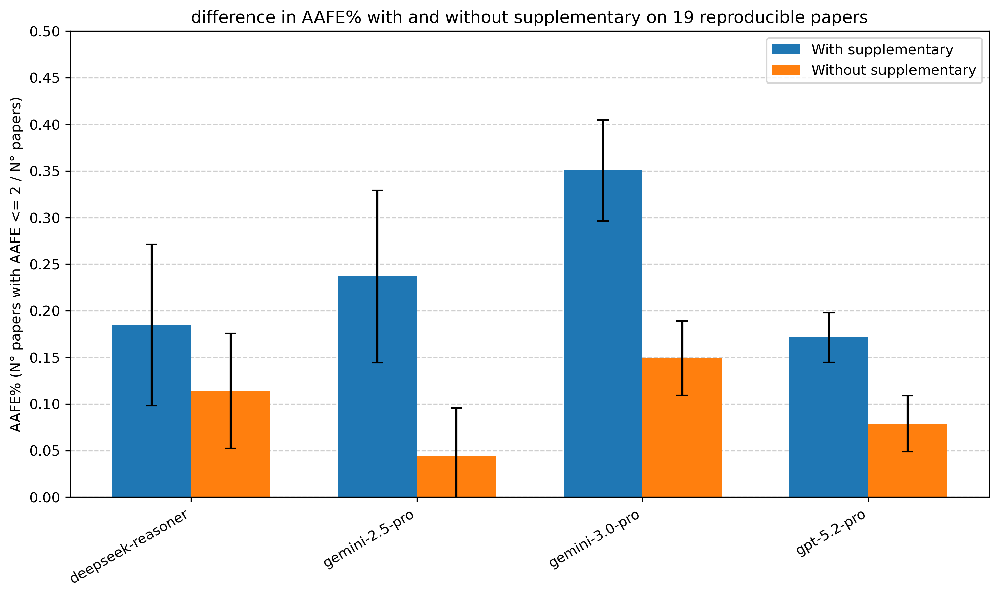
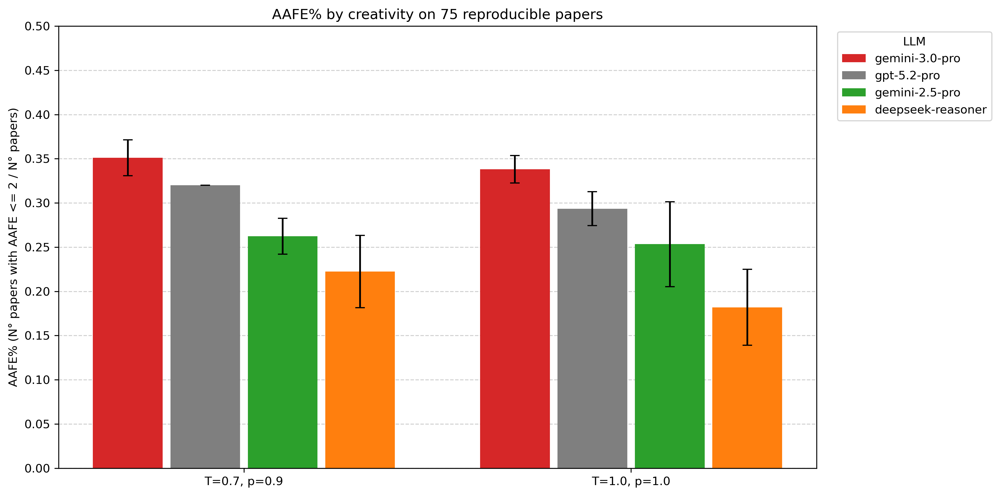
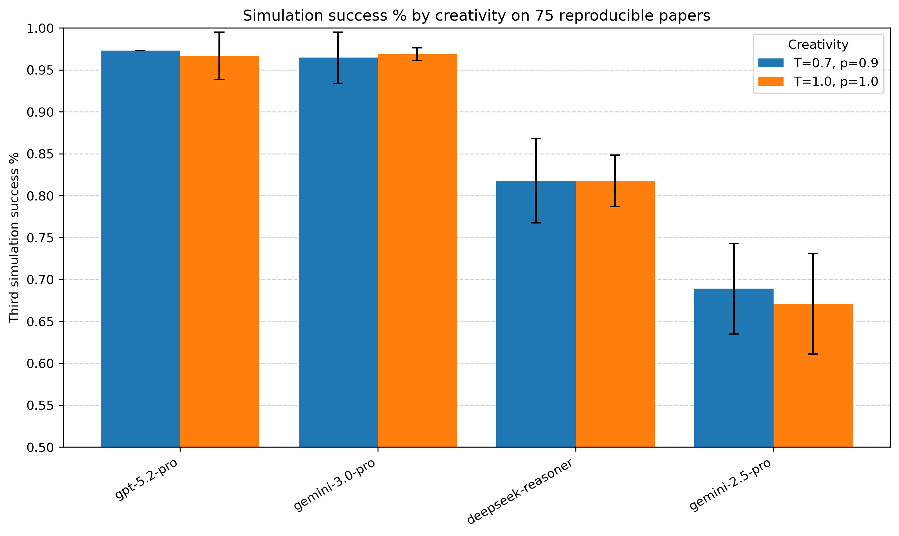

# SBMLLM-Bench: Benchmarking LLMs for automated systems biology model replication

Systems Biology models are often described across equations, figures, tables, supplementary materials, and previous publications. Building them manually requires substantial biological and mathematical expertise.

**SBMLLM-Bench** is a reproducible benchmark for evaluating how well Large Language Models can convert scientific publications into executable Systems Biology models and how closely those generated models match expert-curated references.

> ### Need a new Systems Biology Model?
>
> Before rebuilding the knowledge contained in the literature manually, 
>
> **contact us** @ [bioinformatics@cosbi.eu](mailto:bioinformatics@cosbi.eu) · [COSBI website and contact information](https://www.cosbi.eu/contact)
>

## Table of contents

- [Quick start](#quick-start)
- [Input data](#input-data)
- [Fabric patterns](#fabric-patterns)
- [Performance metrics](#performance-metrics)
- [COSBI's SBMLLM performances](#cosbi-s-sbmllm-performances)
- [Benchmark results](#benchmark-results)

---

# Quick start

The current workflow is configured for **Windows/PowerShell**.

## 1. Clone

```powershell
git clone https://github.com/cosbi-research/SBMLLM-Bench.git
cd SBMLLM-Bench
```

## 2. Create the environment with Mamba

```powershell
mamba env create -n sbmllm-bench -f env.yml
mamba activate sbmllm-bench
```

Check Snakemake:

```powershell
snakemake --version
```

## 3. Configure Fabric

SBMLLM-Bench uses [Fabric](https://github.com/danielmiessler/fabric) to communicate with the LLM.

See the [Fabric documentation](https://github.com/danielmiessler/fabric/blob/main/README.md) for installation and provider configuration.

```powershell
fabric --setup
fabric --listmodels
```

The workflow requires two patterns:

```text
Converter
Editor
```

Confirm that they are installed:

```powershell
fabric --listpatterns
```

## 4. Run

Check the workflow first:

```powershell
snakemake -n
```

Then execute it:

```powershell
snakemake --cores 1
```

Start with one core to keep LLM requests sequential. Increase the number of cores according to the rate limits of your provider.

---

# Input data

Each benchmark case requires:

```text
workdir/input_R/<paper>.md
workdir/expected_output_R/or<paper>.txt
workdir/SpeciesMap/<paper>_speciesMap.csv
```

### Publication

`workdir/input_R/<paper>.md`

The publications distributed with SBMLLM-Bench were converted to Markdown using **Landing.AI Agentic Document Extraction (ADE)**.

### Reference model

`workdir/expected_output_R/or<paper>.txt`

Expert-curated Antimony model used as the reference.

### Species map

`workdir/SpeciesMap/<paper>_speciesMap.csv`

Maps biologically equivalent species names between generated and reference models.

> Want to add a biological system that is not included in the benchmark?
>
> COSBI can build a **new Systems Biology Model from scratch** or **extend an existing model**, using evidence from one or multiple publications and supplementary sources.
>
> [bioinformatics@cosbi.eu](mailto:bioinformatics@cosbi.eu) · [Contact COSBI](https://www.cosbi.eu/contact)

---

# Fabric patterns

SBMLLM-Bench separates **model generation** from **model repair**.

## `Converter`

Receives the scientific paper and returns an Antimony model.

```markdown
# IDENTITY AND PURPOSE

You are an expert systems biologist.

Reconstruct the mathematical model described in the supplied scientific paper.

# INSTRUCTIONS

- Identify species, reactions, compartments, parameters and initial conditions.
- Recover kinetic laws and stoichiometry where available.
- Reconstruct the model described by the authors.
- Do not invent unsupported mechanisms.
- Produce valid executable Antimony.

# OUTPUT INSTRUCTIONS

Return only the Antimony model.
Do not include explanations or Markdown code fences.
```

Used by the workflow as:

```powershell
fabric -s -p Converter
```

## `Editor`

Receives a model that failed simulation together with its error:

```text
<CURRENT ANTIMONY MODEL>

==SIMULATION ERROR==

<ERROR MESSAGE>
```

Example pattern:

```markdown
# IDENTITY AND PURPOSE

You are an expert Antimony model debugger.

Correct the supplied model using the simulation error.

# INSTRUCTIONS

- Fix syntax, undefined symbols, malformed reactions or execution errors.
- Preserve the biological structure whenever possible.
- Return the complete corrected model.

# OUTPUT INSTRUCTIONS

Return only valid Antimony.
Do not include explanations or Markdown code fences.
```

The workflow permits up to **two repair attempts**.

---

# Performance metrics

| Metric | Meaning | Better |
|---|---|---:|
| **1st simulation ratio** | Executable directly after generation | Higher |
| **2nd simulation ratio** | Executable after one repair | Higher |
| **3rd simulation ratio** | Executable after two repairs | Higher |
| **Species %** | Reference species recovered | Higher |
| **Arrow %** | Correct reactants, products and reaction direction | Higher |
| **Reaction %** | Reactions also matching stoichiometry | Higher |
| **Hamming distance** | Structural disagreement | Lower |
| **RMSRE** | Error in stoichiometric coefficients | Lower |
| **AAFE reproducibility** | Models reproducing reference dynamics | Higher |

## AAFE reproducibility

**AAFE (Absolute Average Fold Error)** measures the average multiplicative difference between a generated trajectory and the corresponding reference trajectory.

SBMLLM-Bench computes:

```math
AAFE = 10^{\frac{1}{n}\sum_{i=1}^{n}\left|\log_{10}\left(\frac{G_i}{R_i}\right)\right|}
```

where `G` is the generated trajectory and `R` is the reference trajectory.

- **AAFE = 1** indicates perfect agreement.
- **AAFE = 2** corresponds to an average two-fold difference.
- **AAFE ≤ 2** is considered reproducible.
- Larger values indicate increasingly different dynamics.

[](figures/aafe_difference.png)

**Figure. Illustration of AAFE.** The shaded region highlights the difference between generated and reference trajectories. AAFE summarizes these differences across all simulation time points as a multiplicative fold error.

A generated model satisfies the benchmark reproducibility criterion when **at least one variable shared with the reference model has AAFE ≤ 2**.

---

# COSBI's SBMLLM performances

> **Important:** the results in this section were obtained using **SBMLLM, a COSBI model-generation tool that is not included in this repository**.
>
> SBMLLM-Bench was used to evaluate the models produced by SBMLLM. The figures below therefore show **experimental results obtained with COSBI's SBMLLM workflow**, not results produced automatically by cloning this repository alone.

## Automated Systems Biology Model generation

Using SBMLLM, the best-performing tested configuration, **gemini-3.0-pro**, generated executable models for about **97% of papers**, recovered **86.95% of species** and **85.73% of reactions**, and reproduced the dynamics of **34.5% of models** according to the AAFE criterion.

[](figures/radar_all_llms_raw_latest_inputR.png)

**Figure 1. SBMLLM average performance at automated model replication.** Among the evaluated configurations, gemini-3.0-pro generated executable models for ~97% of papers, recovered 86.95% of species and 85.73% of reactions, and achieved 34.5% dynamical reproducibility.

## Supplementary information matters

A Systems Biology Model is rarely fully described in a single article. Important equations, parameters, assumptions, and experimental details may appear in supplementary information or related publications.

You can collect and convert these sources manually before generating a model.

At **COSBI**, however, we already maintain a literature resource through [**WISE**](https://www.cosbi.eu/news/getting-wise-at-cosbi), where papers and their supplementary information are available in **Markdown format**, ready to be searched and used to inform a new Systems Biology Model. This allows evidence from multiple publications to be combined without preparing every document individually.

The SBMLLM experiments evaluated with SBMLLM-Bench show why this matters: average dynamical reproducibility decreased from **23.3% to 8.7%** when supplementary materials were unavailable.

[](figures/aafe_input_R_suppl_yes_no.png)

**Figure 2. Supplementary materials contain crucial information.** Average reproducibility decreased from 23.3% to 8.7% when supplementary materials were not accessible across the evaluated LLMs.

If you already know the biological system you want to model, or have one or more relevant publications, COSBI can combine **WISE, SBMLLM, and expert curation** to create a new Systems Biology Model or extend an existing one.

## Creativity and AAFE reproducibility

SBMLLM was also evaluated under different creativity settings.

[](figures/aafe_by_creativity.png)

**Figure 3. Effect of creativity on AAFE reproducibility.** Different LLM and creativity configurations produce different levels of dynamical reproducibility, showing that model-generation settings can affect scientific performance.

## Creativity and executable models

[](figures/simulation_success_by_creativity.png)

**Figure 4. Generation of executable Systems Biology Models under different creativity settings.** The benchmark measures whether models can be successfully executed directly or after the repair attempts supported by the workflow.

These experiments are intended to show what can be achieved when **SBMLLM is combined with appropriate literature input, LLM selection, and expert curation**.

If your objective is to build a new Systems Biology Model rather than reproduce the benchmark experiment, contact COSBI instead of starting from zero:

**[bioinformatics@cosbi.eu](mailto:bioinformatics@cosbi.eu) · [COSBI website and contact information](https://www.cosbi.eu/contact)**

---

# Benchmark results

The main benchmark result is:

```text
workdir/test_table.csv
```

It summarizes executability, species and reaction recovery, stoichiometric accuracy, dynamical reproducibility, and model size.